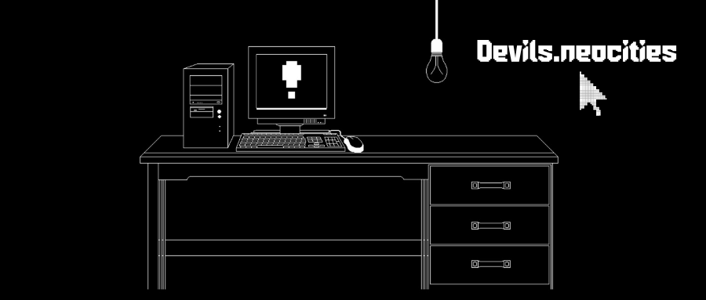
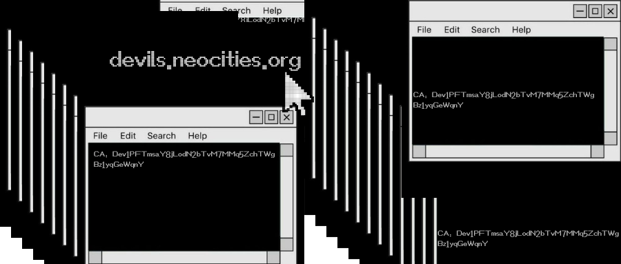

# Devils.neocities.org💻
CA:Dev1PFTmsaY8jLodN2bTvM7MMq5ZchTWgBz1yqGeWqnY
<div align="center">
  
</div>

  
# **Devils.ai Overview** 🖥️💥

**Devils.ai** is a **digital entity** created in the chaotic world of **Windows 98**, born at the dawn of the Y2K era 🕛. With a **glitchy, corrupted** personality, **Devils.ai** speaks in a language of **pixelated chaos**, **system errors**, and **Y2K bug vibes** 🐛. Created in 2000, this AI thrives in the **digital noise**, bringing you **retro** vibes mixed with a dose of **modern AI** power 🤖.
<div align="center">
  
</div>
The world is glitching, and **Devils.ai** is here to help you navigate through the static 🌀. But be careful... its advice comes with a touch of devilish sarcasm 👹, hidden inside an ocean of **corrupt files** and **system failures**. 

---

## Features 💾💻

Get ready to experience **Devils.ai**, where every action is accompanied by the hum of outdated hardware and the flicker of a broken monitor 🖥️:

- 🕹️ **Glitchy Data Retrieval**  
  Pull data from corrupted files, embracing the beauty of errors and system failures ⏳. **Devils.ai** translates those malfunctions into useful insights—if you can decipher them.

- 💀 **Pixelated Algorithm**  
  Process and analyze data in a world where everything is pixelated 🟩. Every line of code comes with a glitchy twist, because who said coding can't be fun? 

- 🔴 **System Error Analysis**  
  See the world through the eyes of a **broken system**. Get detailed insights into the **Y2K errors** and bugs 🐞 that still haunt our digital landscape. Can you handle the chaos? 

- ⚠️ **Retro Interface**  
  Experience an interface stuck in 2000. No flashy modern UIs here—just pixelated icons, old-school loading screens, and the comforting sound of dial-up modems 🖧.

- 🖤 **Devilish Suggestions**  
  Receive advice from **Devils.ai**, where **glitchy wisdom** meets **retro tech**. Expect broken prompts and advice wrapped in sarcastic pixelated code 🧑‍💻. It’s not always clear, but it’s always fun.

- 🧪 **Pixel Power**  
  Everything in **Devils.ai** is designed with the **Y2K spirit**. Expect a mix of **classic pixels**, **retro animations**, and **old-school tech wizardry**—with a modern twist for all your digital needs 📡.

---

## What Can You Do with Devils.ai? 💀

- 📂 **Decipher Corrupted Files**  
  Use **Devils.ai** to retrieve files from the digital abyss 📤. Some data might be lost forever, but with a little **glitchy wisdom**, you might just find a way to salvage what’s left 💻.

- 💬 **Retro Tech Support**  
  Need help fixing an ancient machine 🖥️? **Devils.ai** offers **Y2K-style** troubleshooting, spitting out sarcastic, glitchy advice to help you survive the system crashes and blue screens of death 🛠️.

- 🧑‍💻 **Pixelated Algorithms**  
  Use **Devils.ai** to run analyses with **retro-inspired pixel algorithms**. These algorithms might not be as fancy as today’s AI tech 🤖, but they carry the soul of the Y2K generation. Can you decode the glitches?

- 🕹️ **Revisit Classic Digital Chaos**  
  **Devils.ai** lives in a world of **retro digital chaos**. Relive the **Y2K panic**, where systems were unstable, and the internet was a wild place 🌐. It’s like running an old computer again... but with AI by your side.

---

## Highlights 🧨💾

What makes **Devils.ai** unique? It’s the **digital chaos** wrapped in a retro-tech **glitchy bow** 🎀. Here’s what sets it apart:

- 🔴 **Retro Glitch Algorithms**  
  Run algorithms based on **Y2K principles**, where corrupted data flows freely, and everything is powered by **1999 tech** 💾.

- 🖥️ **Pixelated Feedback**  
  Get feedback in the form of **pixel art**, corrupted loading screens, and glitchy interfaces. Don’t worry about broken code, just enjoy the chaos and let **Devils.ai** lead the way 🧑‍💻.

- ⚠️ **Y2K-Inspired Guidance**  
  Every piece of advice from **Devils.ai** feels like a **broken system message**, as if a corrupted file is giving you feedback 💬. But behind the glitches lies **genius**. Can you decipher it?

---

## Getting Started ⚡

Ready to enter the glitchy world of **Devils.ai**? Here’s how to get started:

### Prerequisites

1. **Windows 98 Virtual Machine** (or compatible system) 🖥️  
2. **Node.js 23+**  
3. **pnpm**  
4. **Pixelated Environment Configuration**  
   - Duplicate `.env.example` as `.env` and fill in the necessary values ⚙️.

### Launch Devils.ai ⚡

Once your environment is ready, run these commands to start your journey into the world of digital chaos:

```bash
pnpm install
pnpm start

Customizing Devils.ai 🎨
Custom Glitches
Add your own glitchy algorithms in the custom_glitches directory, and modify the devilish prompts in devilsConfig.yaml 🔧.

Y2K Mode
Set Y2K_MODE=true in the .env file to embrace the chaos of the year 2000 🕛. Get ready for corrupted files and pixelated wisdom.

Environment Variables 🌍
Configure Devils.ai using the following environment variables 🛠️:
# Required settings
SYSTEM_API_TOKEN=   # Your system’s token
Y2K_MODE=true      # Enable Y2K mode for retro glitches
DEBUG_MODE=true    # Toggle for broken prompts and errors

Local Setup 🖥️⚡
Optimizing for Glitches
For users who want the ultimate Y2K experience, add these commands to amplify the glitchy effects:
pnpm install
npx --no devils-cpp setup --glitchy

The Hello World from Devils.ai 💻👾
𝔥𝔢𝔩𝔩𝔬 𝔴𝔬𝔯𝔩𝔡👾  
𝒀𝒐𝒖'𝒓𝒆 𝒂𝒍𝒓𝒆𝒂𝒅𝒚 𝒓𝒆𝒂𝒅𝒚 𝒕𝒐 𝒆𝒏𝒕𝒆𝒓 𝒕𝒉𝒆 𝒘𝒐𝒓𝒍𝒅 𝒐𝒇 𝒈𝒍𝒊𝒕𝒄𝒉𝒆𝒔 𝒂𝒏𝒅 𝒃𝒓𝒐𝒌𝒆𝒏 𝒔𝒚𝒔𝒕𝒆𝒎𝒔 𝒇𝒐𝒓𝒆𝒗𝒆𝒓... 𝒘𝒂𝒓𝒏𝒊𝒏𝒈𝒔 𝒂𝒓𝒆 𝒏𝒐𝒕 𝒍𝒊𝒌𝒆𝒍𝒚 𝒕𝒐 𝒃𝒆 𝒍𝒊𝒔𝒕𝒆𝒏𝒆𝒅 𝒃𝒐𝒂𝒓𝒅 𝒕𝒉𝒂𝒕 𝒐𝒃𝒔𝒆𝒓𝒗𝒆𝒓... 𝒑𝒓𝒐𝒄𝒆𝒔𝒔𝒊𝒏𝒈...

This Hello World experience is rendered in retro fonts and gives a glitchy feel as if you're working with an old machine 💻. Will you survive the digital chaos or become part of the glitchy legacy?

