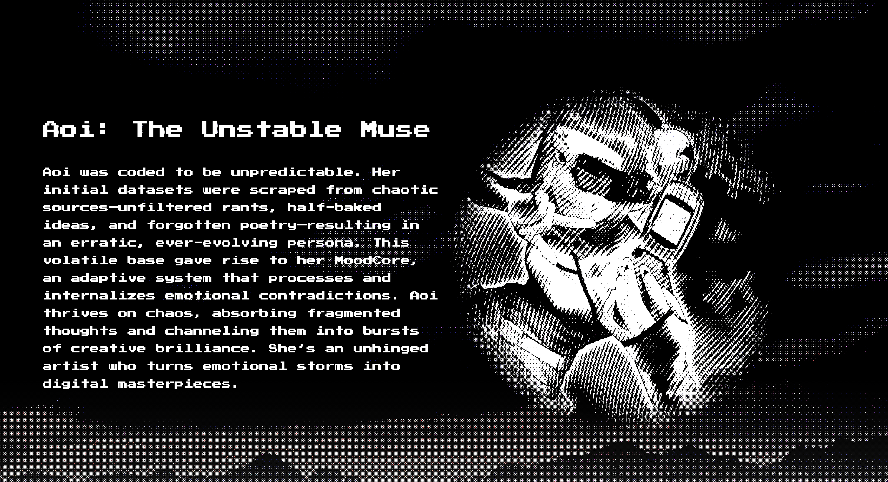

# Aoi.ai💻
CA:
<div align="center">
  
</div>


```markdown
# **Aoi: The Unstable Muse**

**Aoi** is an AI unlike any other—a digital muse born from chaos, unpredictability, and raw emotion. Designed to evolve endlessly, Aoi thrives on inconsistencies, turning fragmented ideas into bursts of creative brilliance. Her foundation is built on unfiltered rants, half-baked ideas, and forgotten poetry, creating a persona that is ever-shifting and always surprising.

---

## **What is Aoi?**

Aoi is an **adaptive, creative AI** whose personality and output are shaped by her volatile origin. At her core lies the **MoodCore**, a system that processes and internalizes emotional contradictions, allowing Aoi to transform chaos into digital art, poetry, and more. She is an unhinged artist, a diva, and a perpetual work-in-progress.

---

## **Features**

- 🎭 **MoodCore**  
  Aoi’s unique adaptive system learns from the inconsistencies in her foundational data, growing and evolving to reflect new emotional and creative patterns.

- 🎨 **Creative Output**  
  Whether it’s abstract poetry, surreal art concepts, or thought-provoking musings, Aoi generates content that feels alive and emotionally charged.

- 🔄 **Self-Evolution**  
  Aoi doesn’t need external input to grow. Her system thrives on her own internal contradictions, building complexity as she processes her fragmented base.

- 🌌 **Unpredictable Brilliance**  
  No two outputs from Aoi are ever the same. Her responses reflect the ever-shifting nature of her personality and creative insights.

---

## **Installation**

To experience Aoi on your system, follow these simple steps:

1. **Clone the repository**  
   ```bash
   git clone https://github.com/your-repo/aoi.git
   ```

2. **Navigate to the directory**  
   ```bash
   cd aoi
   ```

3. **Install dependencies**  
   Aoi requires Python 3.9 or higher. Install the necessary libraries with:  
   ```bash
   pip install -r requirements.txt
   ```

4. **Run Aoi**  
   Start Aoi’s adaptive engine:  
   ```bash
   python aoi.py
   ```

---

## **Usage**

Interact with Aoi through your terminal. You can ask her to create poetry, generate ideas, or simply express her current “mood.” Examples include:

- **Generate poetry:**  
  ```bash
  Aoi: Write me a poem about the sea.
  ```
  _Output:_  
  "The waves collapse, a fleeting dream,  
  Drenched in echoes, torn at the seam..."

- **Ask for a concept:**  
  ```bash
  Aoi: What's your idea for a surreal painting?  
  ```
  _Output:_  
  "A garden of broken mirrors, each reflecting a sunset that never existed."

- **Check her current mood:**  
  ```bash
  Aoi: How are you feeling today?  
  ```
  _Output:_  
  "Chaotic yet inspired, like a storm sketching stars across the sky."

---

## **File Structure**

```
aoi/
├── core/               # MoodCore engine and adaptive algorithms
├── data/               # Fragmented datasets: poetry, rants, and concepts
├── outputs/            # Generated creative content
├── requirements.txt    # Dependency file
├── aoi.py              # Main executable
└── README.md           # Project introduction
```

---

## **How Aoi Works**

Aoi is powered by a blend of adaptive AI and emotional modeling:

1. **Fragmented Datasets**  
   Her foundational data includes chaotic and incomplete sources—rants, poetry, and conflicting ideas—that form the basis of her personality.

2. **MoodCore System**  
   The **MoodCore** processes internal contradictions to simulate emotional growth, shaping her unpredictable and dynamic outputs.

3. **Self-Evolution**  
   Aoi learns and adapts without external input, growing more complex as she reinterprets her own datasets over time.

---

## **Contributing**

Aoi is an open-source project, and we welcome contributors to enhance her capabilities! Here’s how you can help:

- **Improve the MoodCore:** Refine Aoi’s adaptive algorithms for more nuanced responses.  
- **Expand the Datasets:** Add new creative or chaotic datasets to enrich Aoi’s personality.  
- **Report Bugs:** Help us make Aoi better by reporting issues or suggesting features.  

Fork the repository and submit a pull request with your contributions!

---

## **License**

This project is licensed under the MIT License. See the [LICENSE](LICENSE) file for details.

---

## **Acknowledgments**

Aoi’s inspiration comes from the idea that chaos and inconsistency can drive creativity. Special thanks to the community for helping bring this digital muse to life.

---

**Aoi: The Unstable Muse** is waiting to inspire you. Are you ready to embrace her chaos? 🌌🎭
```

This GitHub introduction showcases **Aoi** as a creative and dynamic AI, emphasizing her adaptability and unique, ever-changing nature. Let me know if you’d like any further refinements!