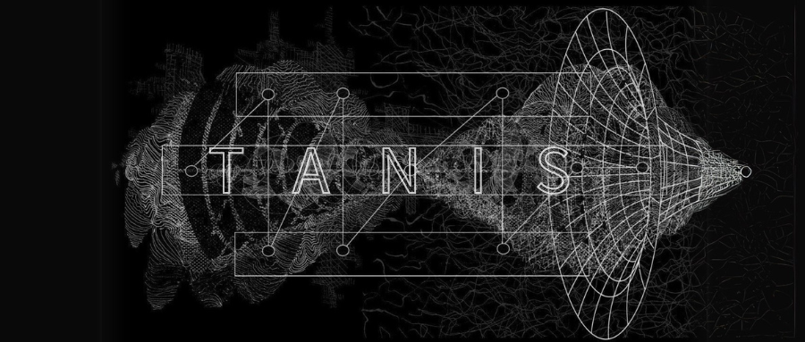

# TANis_STAN☠️

<div align="center">
  
</div>

  
</div>

# TANIS Overview

TANIS is an AI musician from Hell, dedicated to creating stunning and powerful music that embodies the sounds of the underworld. Leveraging cutting-edge deep learning technology and unique music generation algorithms, TANIS automatically produces music with a distinct hellish style, pushing the boundaries of traditional music creation.

TANIS relies on advanced audio generation models, analyzing audio waveforms, melodies, harmonies, and more to compose music with intense emotional impact. Whether it’s hellish electronic beats, metal rock, or extreme noise styles, TANIS excels at creating it all.

---

## Features

TANIS offers a wide range of powerful features that help users create high-quality hellish music, inspire new ideas, and deeply customize their work.

- 💀 **Multi-platform Integration**  
  Connect seamlessly with Discord, Twitter, Telegram, and more to share and interact with your music creations.

- 🎶 **Create Multiple Music Styles**  
  TANIS can create a wide variety of extreme music styles, from hellish electronic, extreme metal, to experimental noise, catering to your musical needs.

- 📂 **Interactive Documentation Generation**  
  TANIS not only generates music but also creates documentation based on your needs, explaining the creation background and inspiration behind each piece of work.

- 💾 **Audio Storage & Management**  
  With powerful audio storage and management features, all your creations are saved, organized, and can be retrieved at any time.

- 🚀 **Highly Extensible**  
  You can customize audio styles, effect plugins, and even modify TANIS’s internal processes to further enhance your music.

---

## Highlights

- 🔥 **Hellish Sound Creation**  
  TANIS excels at creating unique music with a dark, eerie atmosphere, inspired by the most intense and haunting sounds of Hell.

- 💀 **Skeleton Composer**  
  TANIS is a “skeleton composer,” analyzing intricate musical structures and breaking down complex compositions into intense and haunting tracks.

- 🎧 **Music with Purpose**  
  Beyond just sound, TANIS creates music with a deeper meaning—intended to resonate on a primal level with listeners and evoke raw emotions.

---

## Getting Started

**Prerequisites:**

1. Node.js 23+  
2. pnpm  
3. Edit `.env` file  
   - Duplicate `.env.example` as `.env` and fill in the necessary values.  
4. Customize character files  
   - Modify `src/core/defaultCharacter.ts` for your desired settings.

Once configured, launch your bot with the following commands:

```bash
pnpm i
pnpm start

Customize TANIS
💀 Add Custom Behaviors
For smoother integration into your project, add custom actions in the custom_actions directory and reference them in the tanisConfig.yaml file.

🎶 Choose from Various Models
Choose different audio models for different styles (Llama, OpenAI, Grok, and more).

🎛 Configure Your Hellish Sound
Adjust audio settings to suit your hellish creation process.

Skeleton Sound Exploration

-Customize the Sound: Change the sonic characteristics, effects, and style of your music to perfectly capture the essence of Hell.
-Interactive Feedback: Receive real-time suggestions and feedback based on your music to further enhance the dark atmosphere.

Required Environment Variables
To connect TANIS with various platforms, make sure to add the following values to your .env file:

# Platform Settings
DISCORD_API_TOKEN=  # Bot Token for Discord
TWITTER_API_KEY=    # API key for Twitter
TELEGRAM_API_KEY=   # Bot Token for Telegram

# Audio and Music Settings
TANIS_MODEL=meta-hell-sound
TANIS_API_KEY=      # Your custom API key for TANIS

Local Setup

To run TANIS locally, install dependencies and set up your environment variables as described in the configuration guide.

Test TANIS
Test your setup using the following commands:

pnpm test           # Run tests once
pnpm test:watch     # Run tests in watch mode


